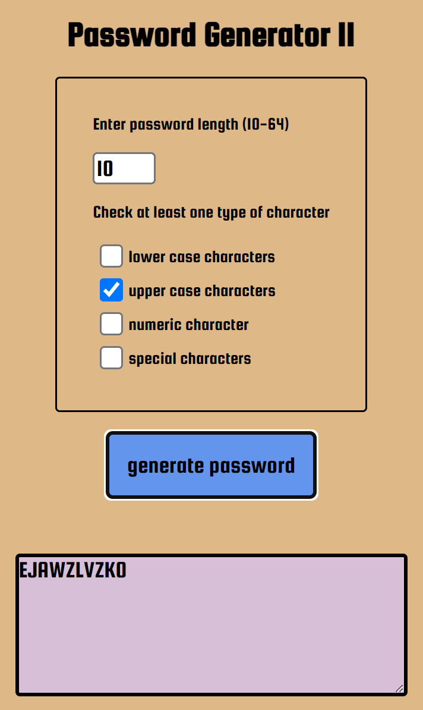

# Password Generator - Bootcamp challenge #5.

##  Password Generator
The user chooses apassword length, and at least one of four possible character sets:
- lower case letters,
- upper case letters,
- numeric chararacters,
- special characters.

If the choices are valid, a password is produced of the chosen length and comprised of randomly chosen characters from the chosen sets.

## Deployment

### [repo](https://github.com/S-R-i-c-e/PasswordII)
### [webpage](https://s-r-i-c-e.github.io/PasswordII/)
javascript code, html rendering, CSS styling. 

## Installation
requires a web-browser - open index.html file.

## Screenshot

## Written by
Stephen Rice 09/01/2022

